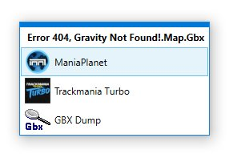

# ManiaVersionSelector
Utility that allows the selection of an installed TrackMania/ManiaPlanet instance when opening a `.Gbx` file

## Usage
When set up, this utility will display a menu allowing you to select from multiple installed games and other tools whenever you open a `.Gbx` file. To edit the programs that are displayed, open the ManiaVersionSelector program directly. If no configuration file exists, a new one will be created and then opened to allow for modifications. After the configuration is saved, the applications specified in the configuration will be available in the menu when opening any `.Gbx` files.

## Prerequisites
You need [.NET Core Desktop Runtime version 3.1 or above](https://dotnet.microsoft.com/download/dotnet-core/3.1) to run this application

## Installation
1. Download the latest release [here](https://github.com/stefan-baumann/ManiaVersionSelector/releases)

2. Extract the contents of the zip file somewhere on your PC

3. Edit the `configuration.json` file to add/specify your game executable paths. Please remember to use double backslashes in your paths instead of single ones (e.g. `C:\\Program Files\\ManiaPlanet\\ManiaPlanet.exe` instead of `C:\Program Files\ManiaPlanet\ManiaPlanet.exe`)

4. Select `ManiaVersionSelector` as the default application for opening `.Gbx` files with using the Windows Explorer

## Upgrading an existing installation
1. Download the latest release [here](https://github.com/stefan-baumann/ManiaVersionSelector/releases)

2. Overwrite your existing files except for the `configuration.json` with the files from the new version

## Todo list
- [ ] Icon, so that `.Gbx` files don't have the generic executable icon
- [ ] Support for commandline arguments for the launched applications
- [ ] Installer
- [ ] Automatic detection of appropriate game version
